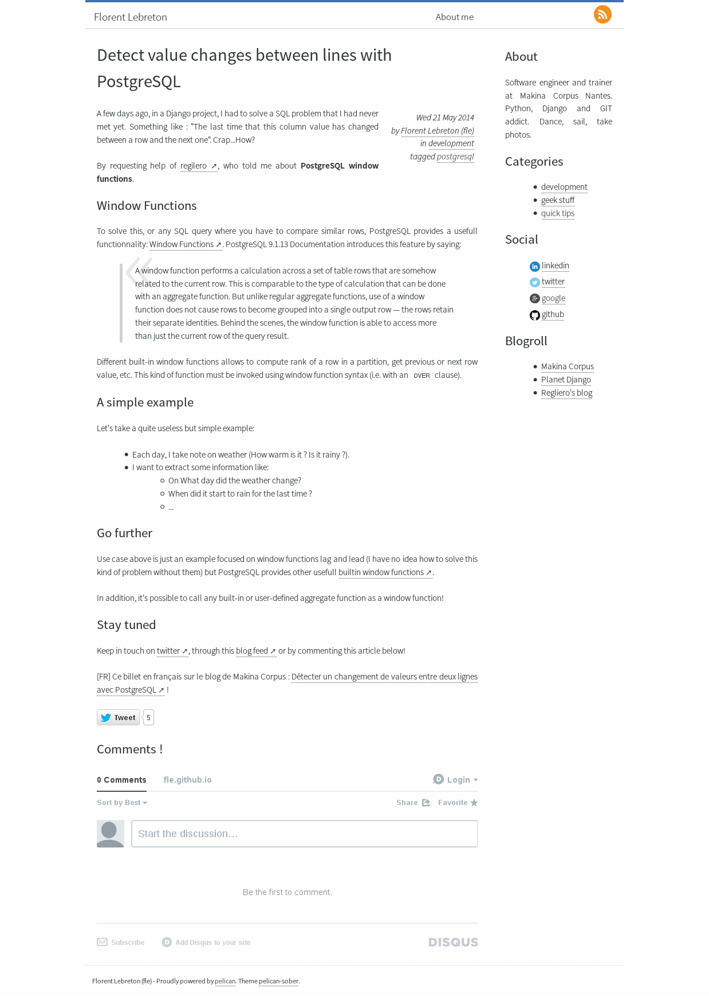
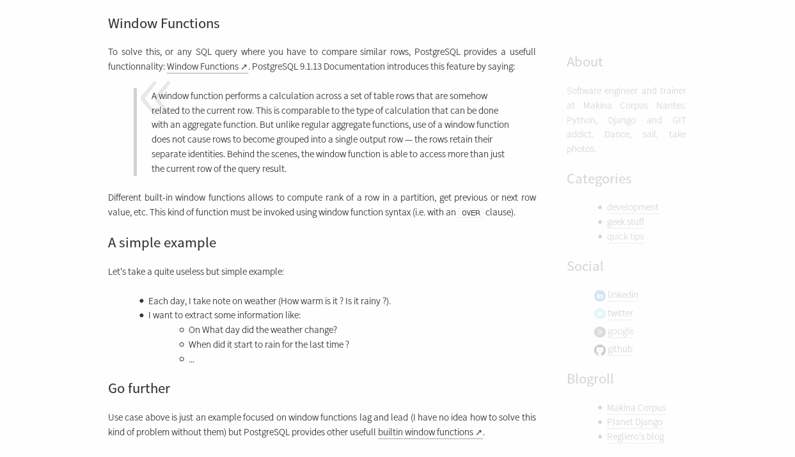

#Pelican Slate#

Pelican-slate is a theme for the Pelican static site generator. It's forked from Pelican-sober, and like Pelican-slate is a very light theme focused on readability :

* Integration of [TinyTypo](http://tinytypo.tetue.net)
* Utilisation of the font Source Sans Pro
* Option to fade out sidebar to focus on article reading

This theme provides also classical features like Google Analytics, Twitter, Disqus and Pygments integration.

## Screenshot ##

## Sidebar options ##

* ``PELICAN_SLATE_ABOUT = "My name is Brian" `` This option allows you to add a short *About* block in sidebar
* ``PELCIAN_SLATE_LICENSE = "<license text here>" `` This option allows you to add a content license to your sidebar.
* ``PELICAN_SLATE_STICKY_SIDEBAR = True | False `` This option allows you to set the sidebar fixed (following scroll and fading out)
* ``PELICAN_SLATE_HISTORY = 3 `` This option allows you to define how many posts are shown in the history in the sidebar.

## Twitter cards ##

[Twitter card metadata](https://dev.twitter.com/docs/cards/types/summary-card) are useful to provides a better overview of your post
when a tweet point to it.

If you provide one of the two settings below, twitter card metadata will be automatically added for each post.

* ``PELICAN_SLATE_TWITTER_CARD_CREATOR = '__fle__' `` (author twitter account)
* ``PELICAN_SLATE_TWITTER_CARD_SITE = '__company__' `` (website/company twitter account)

## Credits ##

* Icons by [Jorge Calvo](http://dribbble.com/shots/1074961-Flat-Icons-EPS), slightly adapted by [Ingrid Hamard](http://ingrid.hamard.free.fr)

